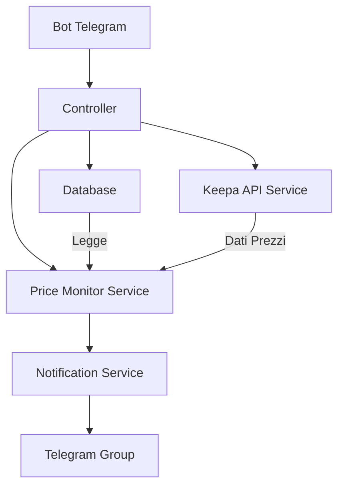
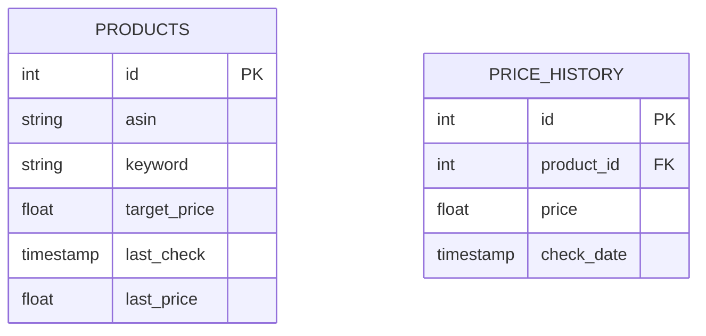
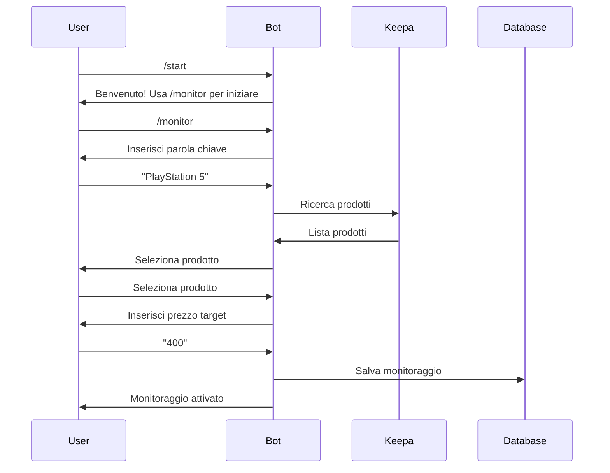

# Piano Architetturale - Bot Telegram Keepa

## 1. Architettura del Sistema



## 2. Componenti Principali

### 2.1 Database (SQLite)


### 2.2 Flusso di Interazione Utente


## 3. Funzionalità Principali

### 3.1 Comandi Telegram
- `/start` - Inizializza il bot
- `/monitor` - Avvia processo di monitoraggio nuovo prodotto
- `/list` - Lista prodotti monitorati
- `/delete` - Rimuove un monitoraggio
- `/status` - Stato del sistema e statistiche

### 3.2 Monitoraggio Prezzi
- Controllo ogni minuto dei prezzi
- Gestione delle rate limit di Keepa (60 req/min)
- Coda di priorità per le richieste

### 3.3 Sistema di Notifiche
```
🛍️ [Nome Prodotto]

💰 Prezzo Attuale: €XXX.XX
📉 Prezzo più basso: €XXX.XX
📊 Variazione: XX%

📈 Storico ultimi 30 giorni:
[Grafico]

🔗 Link prodotto: [URL]

[Immagine prodotto]
```

## 4. Struttura del Progetto
```
keepabot/
├── src/
│   ├── bot/
│   │   ├── commands/
│   │   ├── handlers/
│   │   └── keyboards/
│   ├── services/
│   │   ├── keepa_service.py
│   │   ├── monitor_service.py
│   │   └── notification_service.py
│   ├── database/
│   │   ├── models.py
│   │   └── database.py
│   └── utils/
│       ├── price_formatter.py
│       └── chart_generator.py
├── config/
│   └── config.py
├── requirements.txt
└── main.py
```

## 5. Tecnologie

- **Python 3.9+**
- **python-telegram-bot**: Per l'interfaccia Telegram
- **keepa**: Client ufficiale Keepa
- **SQLAlchemy**: ORM per il database
- **Pillow**: Per la generazione dei grafici
- **aiohttp**: Per chiamate API asincrone
- **SQLite**: Database locale

## 6. Gestione degli Errori

### 6.1 Keepa API
- Gestione rate limiting
- Retry automatico in caso di errori temporanei
- Cache dei risultati per ottimizzare le richieste

### 6.2 Telegram
- Gestione disconnessioni
- Retry per messaggi non consegnati
- Gestione errori di formato

### 6.3 Sistema
- Logging completo
- Monitoraggio risorse
- Backup automatico database