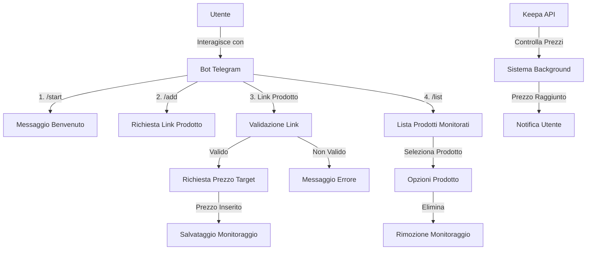
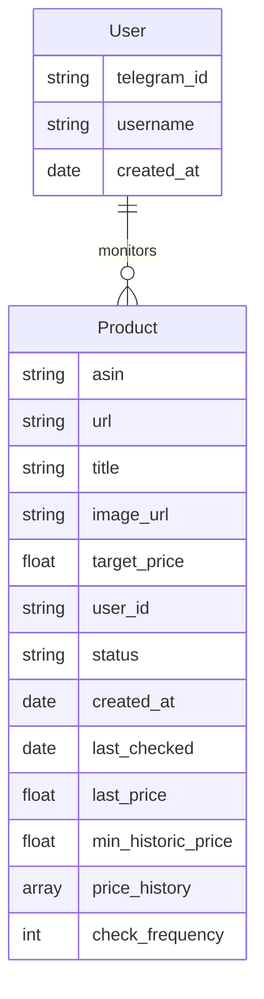

# Piano Implementazione Bot Telegram per Monitoraggio Prezzi Amazon

## Diagramma di Sistema

## Componenti del Sistema

### 1. Bot Telegram (Frontend)
- Interfaccia utente via comandi Telegram
- Gestione interazioni utente
- Formattazione messaggi e notifiche

### 2. Server Node.js (Backend)
- Logica applicativa principale
- Gestione richieste API
- Sistema di scheduling
- Gestione notifiche

### 3. Database MongoDB
- Persistenza dati utenti e prodotti
- Logging operazioni
- Caching risultati API

### 4. Keepa API Integration
- Monitoraggio prezzi
- Frequenza aggiornamento: ogni ora
- Gestione rate limiting e retry
- Caching risposte per ottimizzazione

## Struttura Database

## Sistema di Scheduling

### Configurazione Job
- Frequenza check: ogni ora
- Distribuzione carico: schedulazione distribuita
- Retry automatico: max 3 tentativi
- Backoff esponenziale: 5min, 15min, 30min

### Ottimizzazione API Calls
1. Batch processing prodotti
2. Caching risultati per 30 minuti
3. Prioritizzazione prodotti vicini al target
4. Skip check se prezzo ultimo check molto superiore al target

## Funzionalità Bot

### Comandi Principali
- `/start`: Inizializzazione utente e benvenuto
- `/add`: Aggiunta nuovo prodotto da monitorare
- `/list`: Visualizzazione prodotti monitorati
- `/help`: Guida comandi disponibili
- `/settings`: Gestione impostazioni notifiche

### Gestione Prodotti
1. Validazione link Amazon
2. Estrazione ASIN
3. Verifica disponibilità su Keepa
4. Impostazione prezzo target
5. Conferma monitoraggio

### Visualizzazione Prodotti
#### Vista Dettagliata
- Titolo completo del prodotto
- Immagine miniatura del prodotto
- Prezzo attuale
- Prezzo target impostato
- Prezzo minimo storico
- Data e ora ultimo controllo
- Grafico trend prezzi ultimi 7 giorni

#### Generazione Grafici
- Utilizzo della libreria Chart.js per grafici interattivi
- Dati storici da Keepa API
- Aggiornamento automatico ogni ora
- Indicatori visivi per:
  * Prezzo target
  * Prezzo minimo storico
  * Trend generale (in aumento/diminuzione)

## Stack Tecnologico

### Backend
- Node.js 20.x
- TypeScript 5.x
- node-telegram-bot-api
- MongoDB + Mongoose
- Keepa API SDK
- Bull per job queue
- Chart.js per generazione grafici
- node-canvas per rendering grafici
- sharp per gestione immagini

### Testing
- Jest per unit testing
- Supertest per API testing
- Mock per Keepa API
- Coverage target: 80%

### Deployment
- Docker + Docker Compose
- PM2 per process management
- Nginx come reverse proxy
- Let's Encrypt per SSL

## Sicurezza

### Misure Implementate
- Rate limiting: max 30 req/min per utente
- Validazione input: sanitizzazione dati
- API key rotation
- HTTPS forzato

### Monitoraggio
- Winston per logging
- Sentry per error tracking
- Grafana per metriche
- Alerting automatico

## Gestione Errori

### Strategia
1. Logging dettagliato
2. Retry automatico
3. Fallback graceful
4. Notifiche admin

### Scenari Gestiti
- Timeout API
- Rate limiting
- Network errors
- Database errors

## Roadmap Futura

### Fase 1 (MVP)
- Implementazione core features
- Setup infrastruttura base
- Testing iniziale

### Fase 2 (Ottimizzazione)
- Miglioramento performance
- Espansione test coverage
- Ottimizzazione costi API

### Fase 3 (Scale)
- Implementazione caching avanzato
- Distribuzione geografica
- Analytics utente